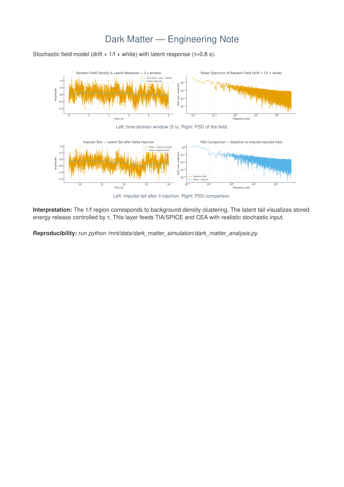

# 🌌 SvetLuna — Dark Matter Simulation

**Core Research Project — 2025**  
Synthetic modeling of dark matter resonance fields using 2D spectral density, anomaly detection (LOF), and resonance correlation analysis.

---

## 🧭 Overview

This project models a synthetic *resonance field* inspired by the physical and informational behavior of dark matter.  
It generates random 2D energy distributions, analyzes their spectral power density (PSD), and detects anomalies using **Local Outlier Factor (LOF)**.

Each experiment produces a unique field visualization and its spectral fingerprint.

---

## 📊 Engineering Note (PSD & latent response)



*Stochastic field model with drift + 1/f + white noise and latent response (τ ≈ 0.8 s).  
Top: time-domain window and power spectral density (PSD).  
Bottom: impulse test and PSD comparison for baseline vs. injected field.*

Reproducibility: run

```bash
python src/dark_matter_analysis.py

---

## 🧩 Project Structure
- `configs/` → YAML configuration files (parameters, noise models)  
- `data/` → Input and reference data (optional)  
- `outputs/` → Simulation outputs, spectra, and plots  
- `src/` → Core source code (simulation, detection, visualization)  
- `Makefile` → Automates setup, run, and visualization  
- `requirements.txt` → Python dependencies  

---

## ⚙️ Run Simulation
```bash
git clone https://github.com/SvetLuna-Lab/SvetLuna-Dark-Matter-Simulation.git
cd SvetLuna-Dark-Matter-Simulation

make setup
make run
make plots

Outputs are saved in:

outputs/figures/

🔬 Methods

Synthetic field construction (pink noise, Gaussian blobs, waveforms)

2D Power Spectral Density (PSD) computation

Resonance feature extraction

Anomaly detection via LOF (Local Outlier Factor)

Visualization of energy distribution and pattern emergence

📊 Example Outputs
Field	PSD	Anomalies	Spectrum

	
	
	

🧭 Engineering Note Preview

Stochastic field model (drift + 1/f + white) with latent response (τ≈0.8 s).

Interpretation:
The 1/f region corresponds to background density clustering.
The latent tail visualizes stored energy release controlled by τ.
This layer feeds TIA/SPICE and CEA with realistic stochastic input.

📘 View Full Engineering Note (PDF)

🧬 Research Direction

This repository belongs to the SvetLuna Research Continuum (2025) —
a transdisciplinary exploration of resonance, energy, and consciousness through machine intelligence.

📘 Previous: Hybrid Atmospheric Installation

🔭 Next: Cascade Resonance Fields & Quantum Echoes (in preparation)

© 2025 Svetlana Romanova (SvetLuna)
Independent researcher — dark matter simulation, hybrid atmospheric energy systems.


---
